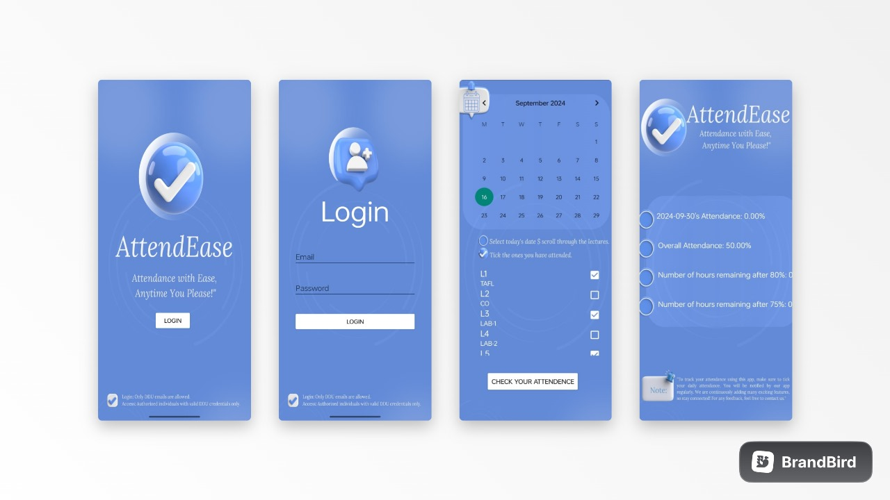

## 𝐀𝐭𝐭𝐞𝐧𝐝E𝐚𝐬𝐞 🎓✨
Attendease is here to simplify attendance tracking for **DDU students**! With an easy-to-use calendar and real-time calculations, students can track their attendance and make sure they stay on top of that crucial 80% mark. 📅✅  

  

## 𝐓𝐞𝐜𝐡𝐧𝐨𝐥𝐨𝐠𝐢𝐞𝐬 𝐔𝐬𝐞𝐝 💻  
- **Java** ☕  
- **Firebase** 🔥  

## What We Learned 📚  
Throughout the journey of building Attendease, we honed our skills in:

- **User Authentication** 🔐: Verifying DDU student credentials through Firebase.  
- **Database Integration** 🗄️: Seamlessly managing student data with Firebase.  
- **User Experience** 🎨: Creating an intuitive and user-friendly interface that makes tracking attendance fun and hassle-free.

## How It Works ⚙️  
1. **Login** 🔑  
   Only DDU students can log in, and we match their credentials with our secure Firebase database to verify their identity.

2. **Select a Date** 📆  
   After logging in, students are greeted with a calendar. They pick the date they want to mark attendance for.

3. **Mark Lectures** 📝  
   Students select which lectures they attended for the day and hit "Calculate Attendance" to log it.

4. **Attendance Calculation** 🎯  
   - Daily attendance is updated instantly.  
   - Total attendance is calculated automatically.  
   - The app even shows how many hours are left for safe "bunking" 🕒 while still maintaining 80% attendance.

## Future of Attendease 🚀  
We’re excited to take Attendease even further with:

- **Smart Notifications** 🔔: Reminders about upcoming lectures and attendance status.  
- **Visual Attendance Trends** 📊: A dashboard showing your attendance over time.  
- **Teacher Integration** 👨‍🏫👩‍🏫: Tools for teachers to track and manage class attendance.
- **Subject-wise Attendance** 📚: A detailed breakdown of attendance for each subject.

With **Attendease**, tracking your attendance has never been easier or more fun! 🎉

**Note:** Attendease is currently available only for DDU students.
